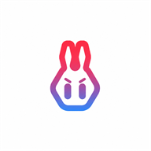

  
  <h1>RikkaHub</h1>

一个原生Android LLM 聊天客户端，支持切换不同的供应商进行聊天 🤖💬

[English](README.md) | [繁體中文](README_ZH_TW.md) | 简体中文

点击链接加入群聊 👉 [【RikkaHub】](https://qm.qq.com/q/I8MSU0FkOu)

  
  

## 关于本 Fork

本仓库是 [rikkahub/rikkahub](https://github.com/rikkahub/rikkahub) 的下游 Fork，会跟随上游合并，同时发布更偏向智能体工作流的 Android 版本 **RikkaRs**。

和上游相比，用户能直接感知到的差异包括：

- **独立应用身份**：安装后应用名显示为 RikkaRs，并使用本 fork 的图标与发布版本。
- **更偏智能体的使用方式**：增强子智能体/委托流程，支持斜杠技能补全、助手级工作目录和更清晰的工具调用记录。
- **工作区文件更容易访问**：工作区项目文件可放到 Android 应用专属外部存储目录，便于通过文件管理器、USB 或电脑直接编辑。
- **本地诊断能力**：可查看请求/文本日志，导出时自动脱敏；用户启用后，也可让 AI 工具读取脱敏后的日志辅助排查。
- **更多设备上下文工具**：在用户授予权限后，助手可使用屏幕使用时间、日历等本地设备信息。
- **提供商导入更方便**：支持导入 NewAPI 渠道 JSON，并保留二维码导入/导出提供商配置。
- **远程访问默认更保守**：内置 Web 服务默认仅监听本机；未启用 JWT 且准备开放到局域网时会给出更明确的提醒。

本 fork 不是上游官方版本；如果你需要上游官方行为与支持，请使用
[rikkahub/rikkahub](https://github.com/rikkahub/rikkahub)。

## 🚀 下载

🔗 [从 GitHub Releases 下载本 fork](https://github.com/Arsucar/rikkahub/releases)（RikkaRs）

🔗 上游官方版本：[官网下载](https://rikka-ai.com/download) / [Google Play](https://play.google.com/store/apps/details?id=me.rerere.rikkahub)

## 💖 赞助商

|                                         赞助商                                         | 介绍                                                                                                                                              |
|:-----------------------------------------------------------------------------------:|:------------------------------------------------------------------------------------------------------------------------------------------------|
|  <b>Aihubmix</b> | 感谢 <a href="https://aihubmix.com?aff=pG7r">aihubmix.com</a> 的资金支持。我们推荐使用 aihubmix 作为全球主流模型的一站式服务平台。（OpenAI、Claude、Google Gemini、DeepSeek、Qwen 以及数百种其他模型）。 |
|  <b>随想AI网关</b> | 感谢随想AI网关对本项目的赞助！随想AI网关 是一家可靠高效的 API 中继服务提供商，提供 Claude、Codex、Gemini 等的中继服务。注重隐私的中转站·无数据倒卖·无模型掺水，隐私，透明，极速售后。新账户注册每日签到就送 0.5 元测试额度，充值额度 1:1，无需订阅，按量付费。多线路冗余、跨区域容灾、自动故障切换，长链路 SSE 不中断。99.9% 可用性，关键调用从不掉队。 |

## ✨ 功能特色

- 🎨 现代化安卓APP设计（Material You / 预测性返回）和 🌙 暗色模式
- 📦 工作区：基于 proot 的 Linux 智能体环境
- 🖥️ Web多端访问支持
- 🛠️ MCP 支持
- 🔄 多种类型的供应商支持，自定义 API / URL / 模型（目前支持 OpenAI、Google、Anthropic）
- 🖼️ 多模态输入支持
- 📝 Markdown 渲染（支持代码高亮、数学公式、表格、Mermaid）
- 🔍 搜索功能（Exa、Tavily、Zhipu、LinkUp、Brave、Perplexity、..）
- 🧩 Prompt 变量（模型名称、时间等）
- 🤳 二维码导出和导入提供商
- 🤖 智能体自定义
- 🧠 类ChatGPT记忆功能
- 📝 AI翻译
- 🌐 自定义HTTP请求头和请求体

## ✨ 贡献

本项目使用[Android Studio](https://developer.android.com/studio)开发，欢迎提交PR

技术栈文档:

- [Kotlin](https://kotlinlang.org/) (开发语言)
- [Koin](https://insert-koin.io/) (依赖注入)
- [Jetpack Compose](https://developer.android.com/jetpack/compose) (UI 框架)
- [DataStore](https://developer.android.com/topic/libraries/architecture/datastore?hl=zh-cn#preferences-datastore) (
  偏好数据存储)
- [Room](https://developer.android.com/training/data-storage/room) (数据库)
- [Coil](https://coil-kt.github.io/coil/) (图片加载)
- [Material You](https://m3.material.io/) (UI 设计)
- [Navigation 3](https://developer.android.com/guide/navigation/navigation-3) (导航)
- [Okhttp](https://square.github.io/okhttp/) (HTTP 客户端)
- [kotlinx.serialization](https://github.com/Kotlin/kotlinx.serialization) (Json序列化)

> [!TIP]
> **Rikka-arsucar fork** 已移除 Firebase，**不需要** `google-services.json`。详见 [docs/RIKKA_ARSUCAR_FORK_AND_CI.md](docs/RIKKA_ARSUCAR_FORK_AND_CI.md)。

> [!IMPORTANT]  
> 以下PR将被拒绝：
> 1. 添加新语言，因为添加新语言会增加后续本地化的工作量
> 2. 添加新功能，这个项目是有态度的
> 3. AI生成的大规模重构和更改

## 💰 捐赠

* [Patreon](https://patreon.com/rikkahub)
* [爱发电](https://afdian.com/a/reovo)

## ⭐ Star History

如果喜欢这个项目，请给个Star ⭐

## 📄 许可证

[License](LICENSE)
